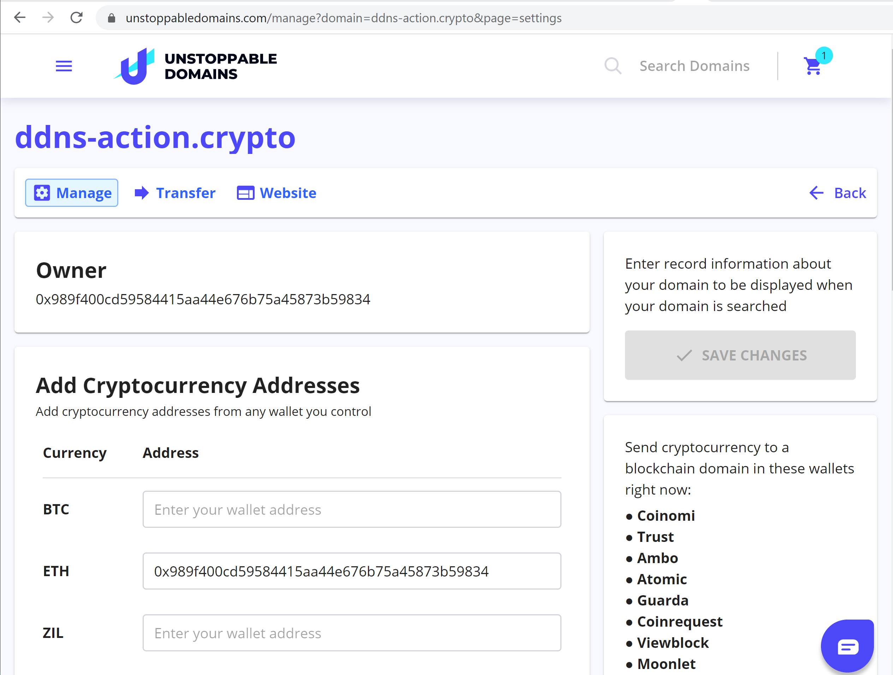

===
CNS
===

`Unstoppable Domains <https://unstoppabledomains.com>`_ launching domain names on blockchain technology. The domain names can be used for both payments and websites. A domain name can’t be taken down by the players that typically participating in the domain name system. Hence, the name Unstoppable Domains. Another value is that It can replace your cryptocurrency addresses with one single human-readable name.

Unstoppable Domains provides `.crypto` (aka CNS) domain names for the entire crypto community.

The `GitHub Action <https://github.com/marketplace/actions/update-ddns>`_ allows updating `.crypto` name during pipeline execution.

Registering a .CRYPTO Name
==========================

This shortened guide will give you instructions of how to register a new .CRYPTO name.
For more detaild take a look at this `step-by-step tutorial <https://medium.com/imtoken/new-crypto-domains-now-on-imtoken-736b2f370576>`_ for registering .CRYPTO name.

Step 1: Open your Ethereum-enabled browser
******************************************
On desktop, this could be Chrome with the extension MetaMask, or the browser Brave with MetaMask (which comes built-in) enabled.

Step 2: Navigate to the Unstoppable Domains web site
****************************************************
In your browser, go to `unstoppabledomains.com <https://unstoppabledomains.com>`_

Step 3: Pass sign up process
****************************

Step 4: Search for your desired .crypto name
********************************************
Login and search for `.crypto` name

Step 5: Checkout
****************
Add `.crypto` name to a cart and go to Checkout page. Choose a suitable payment type and complete payment

Step 6: Connect Wallet to your account
**************************************
Go to Account Settings page and click `Add wallet` button. You need to connect your MetaMask account to the web site in an appeared popup.

Step 7: Claim your domain name
******************************
Go to My Domains page, select domain name and click `Claim`

The process takes time, there is manual approval. You will need to wait for a while.

Step 8: Manage domain name
**************************
After all you will be able to manage your domains. Go to My Domains page and click `Manage` button for the domain name.

Step 9: Set Resolver
********************
In order to do this, you need to add at least one cryptocurrency address (e.g. owner of the name).

Setup pipeline with .CRYPTO update
==================================

Requirements
************

1. Before setting up a pipeline the CNS name should be configured, it should have a resolver. Take a look on prev section

2. `Basic pipeline <github-actions#basic-pipeline-for-a-dapp>`_ should be configured with `step which provides IPFS hash <ipfs>`_

Pipeline step
*************
Open and add the step to `main.yml`::

    - uses: aquiladev/ddns-action@v0.1.1
      with:
        mnemonic: ${{ secrets.MNEMONIC }}
        rpc: ${{ secrets.RPC }}
        name: ddns-action.crypto
        contentHash: ${{ steps.upload.outputs.hash }}

Parameters
**********

- `${{ secrets.MNEMONIC }}` is a secret. The mnemonic phrase is needed for wallet recovery of an account which owns CNS name. It can be a private key of the account as well
- `${{ secrets.RPC }}` is a secret. RPC is a URL of Ethereum Mainnet node
- `ddns-action.crypto` - CNS name which you want to update
- `${{ steps.upload.outputs.hash }}` is content hash. It came from `upload to IPFS step <ipfs>`_

Secrets
*******
In order to manage sercerts in a repository you need to open Settings -> Secrets

Pipeline
********
Eventually pipeline should look like::

    name: CI
    on:
      push:
        branches:
        - master

    jobs:
      build:
        runs-on: ubuntu-latest

    steps:
      - uses: actions/checkout@v2
    
      - name: Setup Node
        uses: actions/setup-node@v1
        with:
          node-version: '10.x'

      - run: npm ci

      - run: npm run build

      - name: Upload to IPFS
        uses: aquiladev/ipfs-action@v0.1.2-alpha
        id: upload
        with:
          path: ./build

      - name: Update CNS
        uses: aquiladev/ddns-action@v0.1.1
        with:
          mnemonic: ${{ secrets.MNEMONIC }}
          rpc: ${{ secrets.RPC }}
          name: ddns-action.crypto
          contentHash: ${{ steps.upload.outputs.hash }}

Run pipeline
************
The pipeline will run immediately after commit (if you committed to master branch)

You can open all pipeline runs and check outputs

.. image:: assets/github-pipeline-details.png
    :align: center

How to access a DApp with .CRYPTO name?
=======================================

Check CNS record
****************
In order to check updated IPFS hash in CNS, you need to open My Domains page, click `Manage` button for the domain name. Then you need to open `Website` tab.

Access DApp
***********
1. You should install `Chrome Extension <https://unstoppabledomains.com/extension>`_. The Extension allows Chrome browser to handle `.crypto` domain names.
2. Type `.crypto` (e.g. ddns-action.crypto) domain name in Chrome browser and you will be redirected to the DApp

