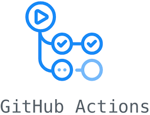
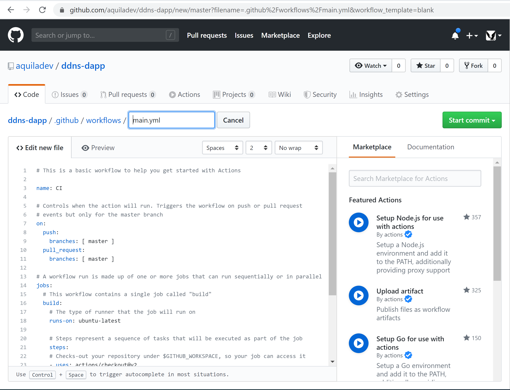

=========================
GitHub and GitHub Actions
=========================

**GitHub** provides hosting for software development version control using Git. GitHub is the largest host of source code in the world `[1] <https://en.wikipedia.org/wiki/GitHub#cite_note-11>`_.

A `decentralized application <https://en.wikipedia.org/wiki/Decentralized_application>`_ (DApp, dApp, Dapp, or dapp) is a computer application that runs on a distributed computing system. DApps have been popularized by distributed ledger technologies (DLT) such as the Ethereum Blockchain, where DApps are often referred to as smart contracts.

Many DApps are open-sourced, most of them are hosted in GitHub. That is why it is important to have proper tooling for delivering DApps.

`GitHub Actions <https://github.com/features/actions>`_ enables everyone to create custom software development life cycle (SDLC) workflows directly in the GitHub repository.

Since GitHub introduced Actions, a single commit is needed to create a pipeline for a DApp. You do not need to use 3rd party services for that anymore.

Basic Pipeline for a DApp
-------------------------

Step 1: Create pipeline
***********************

Open GitHub repository -> Actions -> `New Workflow` -> `Set up a workflow yourself`

Step 2: Modify pipeline
***********************

1. Define a trigger of the pipeline (e.g. only on `master` branch)::

    on:
      push:
        branches:
        - master

2. Leave the definition of the job and run environment::

    jobs:
      build:
        runs-on: ubuntu-latest

3. Define prep-steps::

    steps:
      - uses: actions/checkout@v2

      - name: Setup Node
        uses: actions/setup-node@v1
        with:
          node-version: '10.x'
  
      - run: npm ci
  
      - run: npm run build

Then you need to commit your `main.yml` by pressing `Start commit` button.
