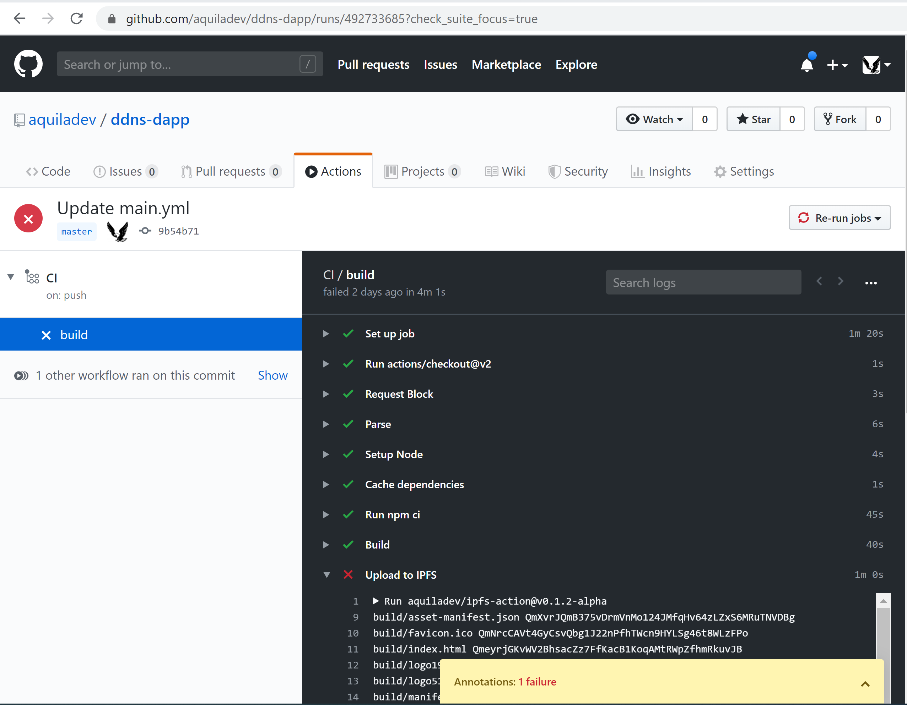

===
ENS
===

`Ethereum Name Service (ENS) <https://ens.domains>`_, a distributed, open, and extensible naming system based on the Ethereum blockchain. It maps human-readable names like `alice.eth` to machine-readable identifiers such as Ethereum addresses, content hashes, and metadata.

The `GitHub Action <https://github.com/marketplace/actions/update-ddns>`_ allows updating `.eth` name during pipeline execution.

Registering .ETH name
=====================

This shortened guide will give you instructions of how to register a new .ETH name.
For more detaild take a look at this `step-by-step tutorial <https://medium.com/the-ethereum-name-service/step-by-step-guide-to-registering-a-eth-name-on-the-new-ens-registrar-c07d3ab9d6a6>`_ for registering .ETH name.

Step 1: Open your Ethereum-enabled browser
******************************************
On desktop, this could be Chrome with the extension MetaMask, or the browser Brave with MetaMask (which comes built-in) enabled.

Step 2: Navigate to the ENS Manager
***********************************
In your browser, go to `app.ens.domains <https://app.ens.domains>`_

Step 3: Search for your desired .eth name
*****************************************

Step 4: Start the registration process
**************************************
Click the blue `Request To Register` button on the bottom right. A box should pop up from MetaMask asking you to confirm the transaction. Click the `Confirm` button to confirm it.

Step 5: Wait
************
The waiting period is required to ensure another person hasn't tried to register the same name

Step 6: Finish registration
***************************
Once your wait time is over, orange text will appear that says `Click register to move to the 3rd step`. Click the blue next to it that says `Register`.

Step 7: Set Relosver
********************
After registration is completed you need to set Resolver.

Setup pipeline with .ETH update
===============================

Requirements
************

1. Before setting up a pipeline the ENS name should be configured, it should have a resolver. Take a look on prev section.

2. `Basic pipeline <github-actions#basic-pipeline-for-a-dapp>`_ should be configured with `step which provides IPFS hash <ipfs>`_

Pipeline step
*************

Open and add the step to `main.yml`::

    - uses: aquiladev/ddns-action@v0.1.1
      with:
        mnemonic: ${{ secrets.MNEMONIC }}
        rpc: ${{ secrets.RPC }}
        name: ddns-action.eth
        contentHash: ${{ steps.upload.outputs.hash }}

Parameters
**********

- `${{ secrets.MNEMONIC }}` is a secret. The mnemonic phrase is needed for wallet recovery of an account which owns ENS name. It can be a private key of the account as well
- `${{ secrets.RPC }}` is a secret. RPC is a URL of Ethereum Mainnet node
- `ddns-action.eth` - ENS name which you want to update
- `${{ steps.upload.outputs.hash }}` is content hash. It came from `upload to IPFS step <ipfs>`_

Secrets
*******

In order to manage sercerts in a repository you need to open Settings -> Secrets

.. image:: assets/github-secrets.png
    :align: center

Pipeline
********

Eventually pipeline should look like::

    name: CI
    on:
      push:
        branches:
        - master

    jobs:
      build:
        runs-on: ubuntu-latest

    steps:
      - uses: actions/checkout@v2
    
      - name: Setup Node
        uses: actions/setup-node@v1
        with:
          node-version: '10.x'

      - run: npm ci

      - run: npm run build

      - name: Upload to IPFS
        uses: aquiladev/ipfs-action@v0.1.2-alpha
        id: upload
        with:
          path: ./build

      - name: Update ENS
        uses: aquiladev/ddns-action@v0.1.1
        with:
          mnemonic: ${{ secrets.MNEMONIC }}
          rpc: ${{ secrets.RPC }}
          name: ddns-action.eth
          contentHash: ${{ steps.upload.outputs.hash }}

Run pipeline
************

The pipeline will run immediately after commit (if you committed to master branch)

.. image:: assets/github-pipeline.png
    :align: center

You can open all pipeline runs and check outputs

How to access a DApp with .ETH name?
====================================

After a successful run of the pipeline, you should be able to access your updated DApp, but it takes some time on IPFS side to resolve newly uploaded content.

Check ENS record
****************

In order to check updated IPFS hash in ENS, you need to open https://app.ens.domains

Access DApp
***********

The easiest way to open your DApp through http://eth.link

